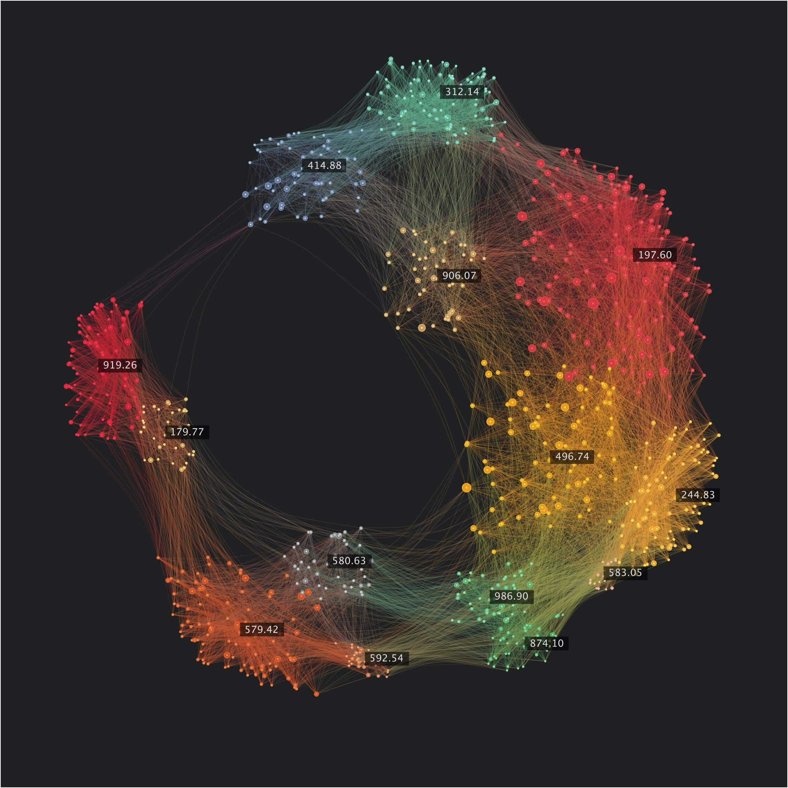
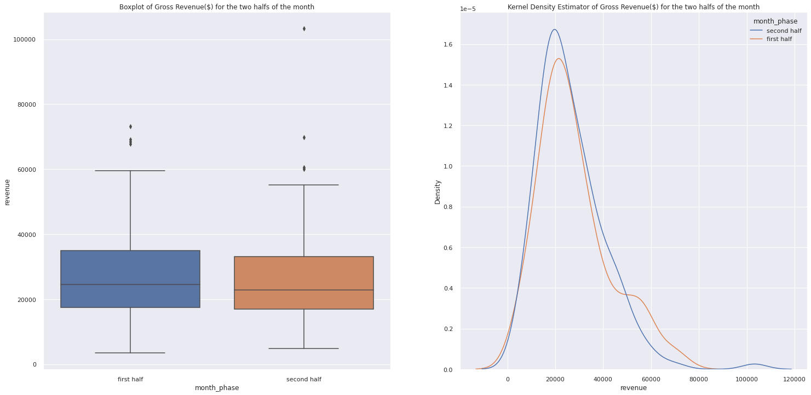
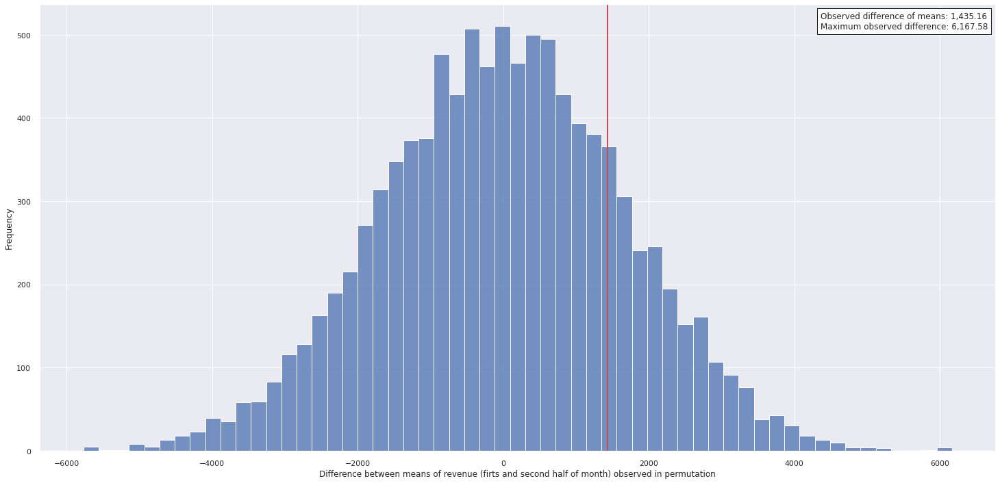
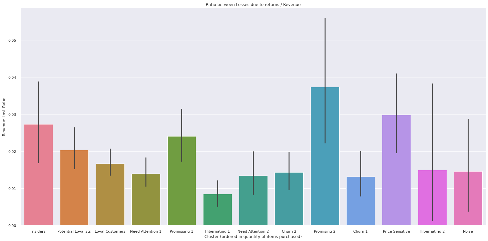
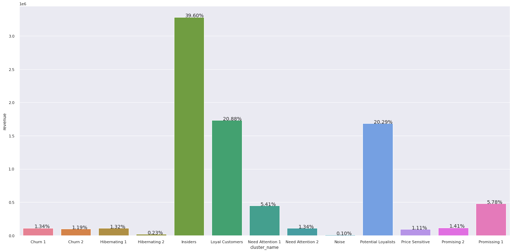
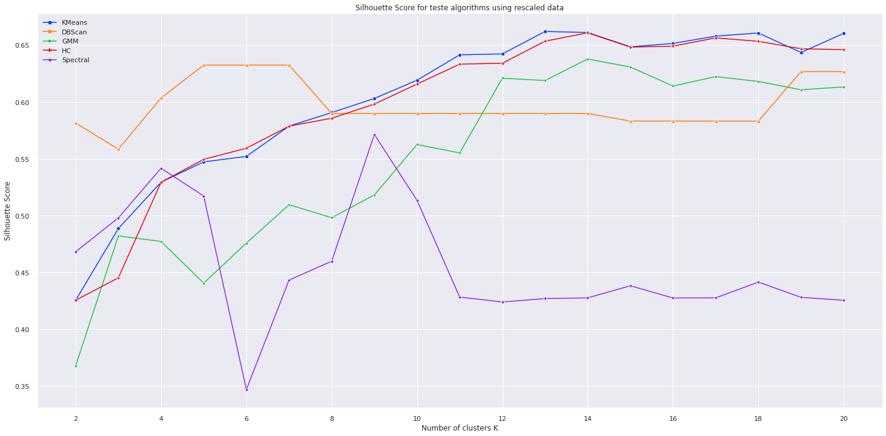
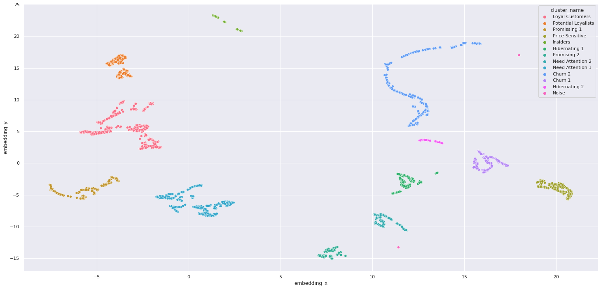
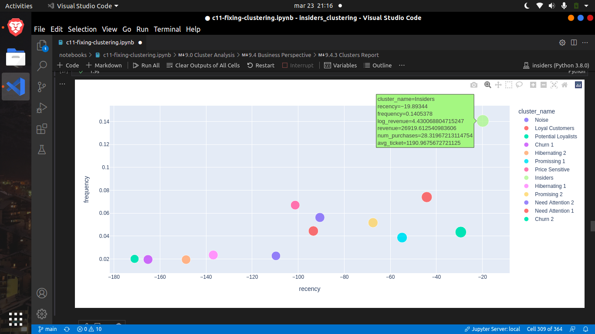
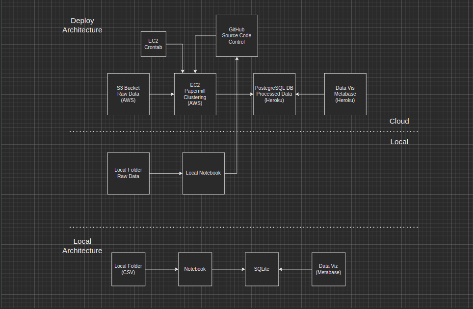

# Insiders Clustering

## Selecting Customers for a Loyalty Program.

#### This project was authored by Humberto Aguiar.

# Business Problem.
The business problem of this project is segmenting customers from an e-commerce company to:
- Select potential customers for a loyalty program (I called the program Insiders Loyalty Program just to name the project).
- Find potential customer clusters to understand customer spending habits better.
- Generate "Business Levers" for each cluster if possible.
- Find insights about customers' spending habits

### Sidenote:
If you would like to view my source code, for the data analysis and machine learning modeling I recommend following the notebook of the last cycle [notebook 11](https://github.com/humberto-aguiar/Insiders-Loyalty-Program/blob/main/notebooks/c11-fixing-clustering.ipynb).

Moreover, to view the deployment in AWS cloud part, the latest CRISP cycle notebook is the [notebook 17](https://github.com/humberto-aguiar/Insiders-Loyalty-Program/blob/main/notebooks/c17-deploy-v1.ipynb)

If you would wish, you may interact with the public view of the dashboard I designed in the deployment stage:

# Business Assumptions.
- There are customers with similar spending habits, and customers can therefore be segmented.
- Customers' spending can be influenced to some extent by the levers defined.

# Solution Strategy

My strategy to solve this business problem is described in more detail in section "0.5 Solution Method" of every notebook.

In general terms, it can be summarized as:
- Reversing the problem to start by the output (a great approach to start solving a complex problem)
- Generating a fictional result table to serve as a project goal (outcome visualization)
- Breaking the problem into smaller steps
- Define metrics of success
- Execute all steps as quickly as possible to evaluate results
- Iterate until an MVP is obtained

**Step 01. Data Description:** Exploring the raw data and formatting it into a usable data frame.

**Step 02. Data Filtering:** Removing inconsistencies found in data

**Step 03. Feature Engineering:** Trying to generate features based on business knowledge

**Step 04. Exploratory Data Analysis:** Exploring data to find correlations and verify data distributions. Also testing several embedding methodologies

**Step 05. Data Preparation:** Applying feature rescaling and encodings

**Step 06. Feature Selection:** Selecting most important features

**Step 07. Model Testing:** Testing several clustering algorithms and evaluating their performance

**Step 08. Model Training:** Finding best hyperparameters for the selected model

**Step 09. Cluster Analysis:** Analyzing clusters found and their silhouette

**Step 10. Convert Model Performance to Business Values:** Evaluating hypotheses about business, possible business questions, describing clusters formed, and defining simple business levers

**Step 11. Deploy Model:** Make the model accessible for others using some cloud service 

# Top 3 Data Insights

**Customers buy 10% more on the first half of the month (H3)**
**False** There is no significant difference between gross revenue in the first and second halves of the month

I executed some statistical tests to confirm this:
Mann-Whitney U test for difference of medians (since data does not follow a normal distribution). The test yielded a p-value of 0.44, therefore we do not reject the null hypothesis of equality of medians (we would have a 44% chance of being wrong rejecting H0)

The second test I executed is a permutation test (which doesn't require normality of data), to compare the difference between the means of the two groups and the difference observed between them lies well in the range that chance could produce permutating observations 10000 times.

**Customers who buy more items are the ones that return less (H2)**
**False** One of the highest return rates is from "promising" and "price-sensitive" customers. Even though, in absolute terms, this hypothesis would be true for "Insiders" customers.

This graph tells us that for each $1.00 a customer from cluster price-sensitive spends, we'll lose $0.03 in a year.

**Customers from Insiders Program are responsible for 40% of revenue (H4)**

# Machine Learning Model Applied

The following models were applied: KMeans, Density-Based Spatial Clustering, Gaussian Mixture Hierarchical Clustering, and Spectral Clustering.

The embedding methods tested were: Principal Component Analysis (PCA), T-distributed Stochastic Neighbor Embedding (t-SNE),
Uniform Manifold Approximation and Projection for Dimension Reduction (UMAP), Random Trees Embedding, and a combination of Random Forest Embedding and UMAP.

Finally, the chosen models were tested for both rescaled and embedded data. The results of data embedded presented much better separation and the best performing out of all tests was the Tree Embedded and UMAP reduced data applied to the DBSCAN model.

# Machine Learning Model Performance

Silhouette Coefficient for the tested models:

An image of the embedding space and clusters found in the Tree Embedded and UMAP reduced data:

# Business Results

The clusters found have several features that might be hard to compare through a table. To simplify the visualization of the results I generated an interactive plot using Plotly's scatter function (only generated if you run the cells of the notebook)

These are some simple business levers I would suggest to the company:

| Cluster | Name | Action Plan  |
|-|-|-|
| 4 | Insiders | Keep engaged, offer concierge  |
| 1 | Potential Loyalists | Increase purchase frequency  |
| 0 | Loyal Customers | Increase average ticket  |
| 2 | Promissing 1 | Increase frequency  |
| 8 | Need Attention 1 | Decrease recency  |
| 6 | Promising 2 | Increase avg ticket  |
| 7 | Need Attention 2 | Increase avg ticket |
| 5 | Hibernating 1| Make them buy again |
| 10 | Churn 1 |Make them buy again |
| 3 | Price Sensitive | Increase avg ticket, Show more promos |
| 11 | Hibernating 2 | Do nothing |
| -1 | Noise | Ignore |
| 9 | Churn 2 | Do nothing |

# Deploy Architecture:
The deployment architecture I designed is the following:

Below is the link to the public view of the Metabase dashboard I designed.

# Conclusions
Clustering is a very challenging machine learning application (much more than I thought) since there is no "right answer".
Business knowledge must be used to evaluate results because good cluster separation doesn't imply good results.
It was possible to find a good separation in this case only by using a combination of ensemble and embedding methods (simply by rescaling data didn't give such good results)
Outputs:
- Reports and notebooks generated.
- Business levers
- Hypotheses tested
- Dashboard with results
- PostgreSQL database with clusters
- AWS instance with automation (updates results monthly and inserts them into the database)

# Lessons Learned
- Tree algorithms are awesome! In this project, they were used for embedding purposes and outperformed several complex manifold algorithms alone.
- When deploying anything to the cloud always use GitHub in between so that you have a common reference and do not get lost.
- Be very careful using manifold learning specially UMAP, any small changes to the data may result in a significant change in the results obtained.
- When saving interim or processed data in CSV format to load it later and save time specify proper precision. Usually, it doesn't make any difference, however small changes in data precision caused UMAP to perform differently across runs (even though I set a random state). This cost me about two days of debugging.
- The silhouette coefficient is negatively affected by not spherical clusters (even when there is no overlap between clusters).

# Next Steps to Improve
- Implement a more complete CI/CD solution to automatically pull changes from GitHub into the EC2 instance (Github Actions, Jenkins, or Airflow).
- Apply a moving average such as ARIMA or SARIMA model to forecast each cluster revenue.
- Attempt to generate more insights using basket analysis methodologies.
- Develop and deploy another more interactive dashboard or app to explore clusters.
- In a real-world application segment incoming customers monthly.

# Author Humberto

If I can be of assistance, or you have any recommendations please do not hesitate to contact me:

